## 게시판 관리자 사이트

- 프로젝트 : 학교 프로젝트
- 언어 : Java
- 프레임워크 : Spring
- 라이브러리 : Spring Boot, JPA, QueryDSL, Thymeleaf
- DB : MariaDB
- 기간 : 2022. 04. ~ 06.


#
# 로직 상세

로그인 순서
- MemberController -> MemberService 유저 id, pw 확인 -> 미 가입 유저 시 반환값에 따라 처리
  - 미가입 시 id, pw가 틀렸다고 나타내도록 세션 생성
  - 가입된 사용자일 시
    - 거부된 사용자일 경우 메시지를 보냄
    - 이상이 없다면 메인화면으로 이동

전체적인 기능
- 회원의 권한에 따라 접근 가능한 서비스가 다름
  - 비로그인
    - 회원 정보를 볼 수 없고 회원 가입만 가능
    - 게시글 조회 불가능
  - 일반 회원
    - 회원 정보를 볼 수 있음
    - 게시글 목록, 조회, 작성, 수정 가능
    - 자신의 게시글만 수정, 삭제 가능
  - 관리자 회원
    - 회원 정보를 볼 수 있음
    - 회원 목록을 볼 수 있음
    - 회원의 차단, 관리자 설정을 할 수 있음
    - 게시글 목록, 조회, 작성, 수정 가능
    - 모두의 게시글을 수정, 삭제 가능
    - 게시글을 차단할 수 있음


#
# 구현 상세

### ◈ 게시판 프로젝트의 메인화면
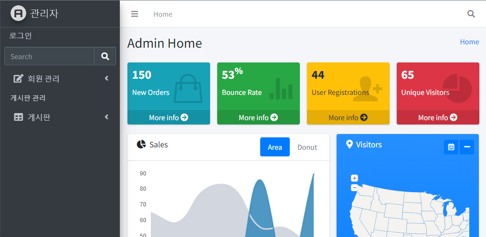

```html
index.html

<script th:inline="javascript">
  /*<![CDATA[*/
  $(document).ready(function () {
    if ([[${session.isreject}]] === true) {
      alert("사용 중지된 사용자입니다. 관리자에게 문의 바랍니다.");
    }
  });
  /*]]>*/
</script>

<div th:replace="~{head/header :: header}"></div>
```

세션에 따라 차단된 사용자에게 경고창을 보여줍니다.

공통된 header html 소스에 대해 대체하는 thymeleaf 태그 th:replace


#
### ◈ 로그인 관련
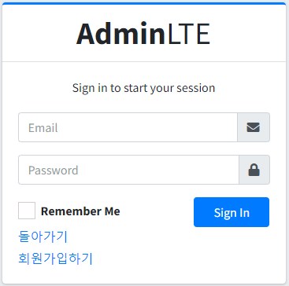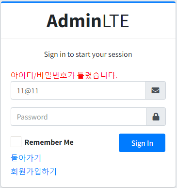


```html
members/login.html

<form th:action="@{'/members/login'}" th:object="${member}" th:method="post">
  <span th:if="${session.isSuccess != null}" size="6px" style="color:red">아이디/비밀번호가 틀렸습니다.</span>
  <div class="input-group mb-3">
    <input type="email" class="form-control" th:name="email" placeholder="Email" th:field="*{email}">
    <div class="input-group-append">
      <div class="input-group-text">
        <span class="fas fa-envelope"></span>
      </div>
    </div>
  </div>
  <div class="input-group mb-3">
    <input type="password" class="form-control" th:name="pw" placeholder="Password" th:field="*{pw}">
    <div class="input-group-append">
      <div class="input-group-text">
        <span class="fas fa-lock"></span>
      </div>
    </div>
  </div>
</form>
```

로그인 화면 설정상태
전송된 세션에서 사용자가 잘못된 로그인이 진행되었는지 확인합니다.

세션에서 modelAttribute로 전환해야 합니다.

프론트 부트스트랩에 의해 특수문자와 이메일 @ 입력에 대해 처리하도록 지원합니다.

```java
MemberController

@GetMapping("/login")
public String getLoginForm(Model model, HttpSession session){
    session.removeAttribute("isSuccess");
    model.addAttribute("member",Member.builder().build());
    return"members/login";
}

@PostMapping("/login")
public String postLogin(@ModelAttribute("member") Member member, HttpServletRequest request) {
    Member dto = null;
    HttpSession session = request.getSession();
    sessionOutService.setSession(session);

    if ((dto = memberLoginService.loginByEmail(member)) != null) {
        session.setAttribute("login", dto);
        session.setAttribute("isreject", false);

        if (dto.getStatus() == Status.REJECT) {
            session.removeAttribute("login");
            session.setAttribute("isreject", true);
            return "/index";
        }

        log.info("login test log : {}", session.getAttribute("login"));

        return "redirect:/index";
    }
    else {
        session.setAttribute("isSuccess", false);
        return "members/login";
    }
}

@GetMapping("/logout")
public String getLogout(HttpSession session) {
    session.invalidate();
    return "redirect:/index";
}
```

로그인 화면을 띄우는 함수들

```java
MemberService

@Override
public Member loginByEmail(Member member) {
    Member dto = null;
    Object result = memberRepository.getMemberByEmail(member.getEmail(), member.getPw());
    if (result != null) {
        dto = entityToDto((MemberEntity) result);
    }

    return dto;
}

MemberRepository

@Query(value="select m from MemberEntity m where m.email = :email and m.pw = :pw")
Object getMemberByEmail(@Param("email") String email, @Param("pw") String pw);
```

JpaRepository, QuerydslPredicateExecutor를 활용해 @Query annotation을 활용해 SQL문을 직접 작성해 유저의 정보를 가져옵니다.


#
### ◈ 회원별 로그인
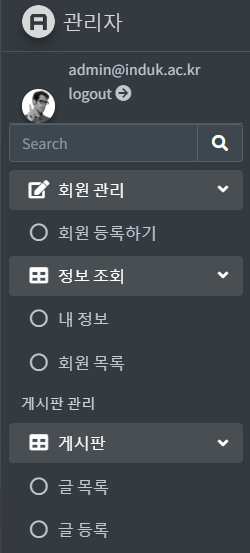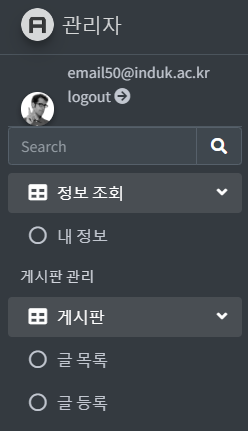

```html
header.html

<div class="user-panel mt-8 pb-8 mb-8 d-flex">
  <div class="" th:if="${session.login != null}">
    <div class="image">
      
    </div>
    <div class="info">
      <a th:href="@{'/members/logout'}" class="d-block">[[${session.login.email}]]
        <br/>logout <i class="fas fa-arrow-circle-right right"></i>
      </a>
    </div>
  </div>
  <div th:if="${session.login == null}">
    <div class="info">
      <a th:href="@{'/members/login'}" class="d-block">로그인</a>
    </div>
  </div>
</div>
<li class="nav-item" th:if="${(session.login == null) or (session.login.status == T(iducs.springboot.lmoboard.domain.Status).ADMIN)}">
  <a href="#" class="nav-link">
    <i class="nav-icon fas fa-edit"></i>
    <p>
      회원 관리
      <i class="fas fa-angle-left right"></i>
    </p>
  </a>
  <ul class="nav nav-treeview">
    <li class="nav-item">
      <a th:href="@{'/members/registerForm'}" class="nav-link">
        <i class="far fa-circle nav-icon"></i>
        <p>회원 등록하기</p>
      </a>
    </li>
  </ul>
</li>
<li class="nav-item" th:if="${session.login != null}">
  <a href="#" class="nav-link">
    <i class="nav-icon fas fa-table"></i>
    <p>
      정보 조회
      <i class="fas fa-angle-left right"></i>
    </p>
  </a>
  <ul class="nav nav-treeview">
    <li class="nav-item">
      <a th:href="@{'/members/' + ${session.login.seq}}" class="nav-link">
        <i class="far fa-circle nav-icon"></i>
        <p>내 정보</p>
      </a>
    </li>
  </ul>
  <ul class="nav nav-treeview" th:if="${session.login.status == T(iducs.springboot.lmoboard.domain.Status).ADMIN}">
    <li class="nav-item">
      <a th:href="@{'/members'}" class="nav-link">
        <i class="far fa-circle nav-icon"></i>
        <p>회원 목록</p>
      </a>
    </li>
  </ul>
</li>
<li class="nav-item" th:if="${session.login != null}">
  <a th:href="@{/boards/registerForm}" class="nav-link">
    <i class="far fa-circle nav-icon"></i>
    <p>글 등록</p>
  </a>
</li>
```

회원의 권한에 따라 비로그인, 일반회원, 관리자 등에 따라서 선택 가능한 메뉴가 다릅니다.


#
### ◈ 회원 목록
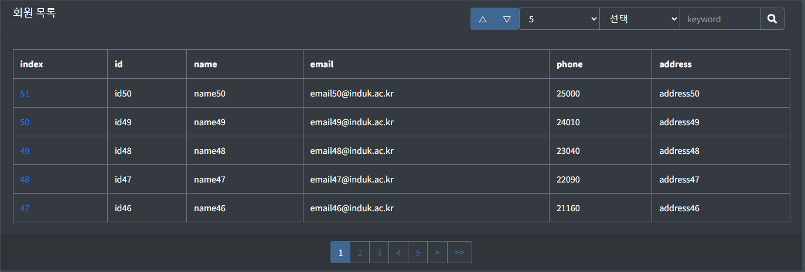
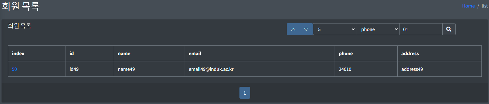

```html
members/lists.html

<div class="btn-group">
  <button type="submit" class="btn btn-primary" name="order" value="0" th:attr="aria-pressed=${pageRequestDTO.order == 0 ? 'true' : 'false'}">
    △
  </button>
  <button type="submit" class="btn btn-primary" name="order" value="1" th:attr="aria-pressed=${pageRequestDTO.order == 1 ? 'true' : 'false'}">
    ▽
  </button>
</div>
<div class="input-group input-group-sm=" style="width: auto; height: auto">
  <select class="form-control" name="size">
    <option value="5" th:selected="${pageRequestDTO.size == 5}">5</option>
    <option value="10" th:selected="${pageRequestDTO.size == 10}">10</option>
    <option value="20" th:selected="${pageRequestDTO.size == 20}">20</option>
    <option value="50" th:selected="${pageRequestDTO.size == 50}">50</option>
  </select>

  <select class="form-control" name="type">
    <option value="" th:selected="${pageRequestDTO.type == ''}"> 선택 </option>
    <option value="e" th:selected="${pageRequestDTO.type == 'e'}">email</option>
    <option value="p" th:selected="${pageRequestDTO.type == 'p'}">phone</option>
    <option value="a" th:selected="${pageRequestDTO.type == 'a'}">address</option>
    <option value="ea" th:selected="${pageRequestDTO.type == 'ea'}">email+address</option>
  </select>
  <input type="text" name="keyword" class="form-control col-6" placeholder="keyword" th:field="*{pageRequestDTO.keyword}">
</div>

<tbody>
<tr th:each="member : ${list.dtoList}">
  <td><a th:href="@{'/members/' + ${member.seq}}" >
    [[${member.seq}]]</a>
  </td>
  <td><span th:text="${member.id}" /></td>
  <td><span th:text="${member.name}" /></td>
  <td><span th:text="${member.email}" /></td>
  <td><span th:text="${member.phone}" /></td>
  <td><span th:text="${member.address}" /></td>
</tr>
</tbody>

<ul class="pagination justify-content-center m-0">
  <li class="page-item" th:if="${list.firstPage}">
    <a class="page-link" th:href="@{/members(page=1, size=${pageRequestDTO.size}, type=${pageRequestDTO.type}, order=${pageRequestDTO.order}, keyword=${pageRequestDTO.keyword})}">
      <b><<</b>
    </a>
  </li>

  <li class="page-item" th:if="${list.prevPage}">
    <a class="page-link" th:href="@{/members(page=${list.startPage - 1}, size=${pageRequestDTO.size}, order=${pageRequestDTO.order}, type=${pageRequestDTO.type}, keyword=${pageRequestDTO.keyword})}">
      <b><</b>
    </a>
  </li>

  <li th:class="'page-item' + ${list.currentPage == page? ' active':''}" th:each="page : ${list.pageList}">
    <a class="page-link" th:href="@{/members(page=${page}, size=${pageRequestDTO.size}, order=${pageRequestDTO.order}, type=${pageRequestDTO.type}, keyword=${pageRequestDTO.keyword})}">[[${page}]]</a>
  </li>

  <li class="page-item" th:if="${list.nextPage}">
    <a class="page-link" th:href="@{/members(page=${list.endPage + 1}, size=${pageRequestDTO.size}, order=${pageRequestDTO.order}, type=${pageRequestDTO.type}, keyword=${pageRequestDTO.keyword})}">
      <b>></b>
    </a>
  </li>

  <li class="page-item" th:if="${list.lastPage}">
    <a class="page-link" th:href="@{/members(page=${list.totalPage}, size=${pageRequestDTO.size}, order=${pageRequestDTO.order}, type=${pageRequestDTO.type}, keyword=${pageRequestDTO.keyword})}">
      <b>>></b>
    </a>
  </li>
</ul>
```

순서대로 검색 조건 설정, 회원 정보, 페이지 처리 소스 코드 입니다. 

```java
MemberController

@GetMapping("")
public String getMembers(PageRequestDTO pageRequestDTO, HttpSession session, Model model) {
    model.addAttribute("list", memberPageService.readListBy(pageRequestDTO));
    return "members/lists";
}

MemberService

@Override
public PageResultDTO<Member, MemberEntity> readListBy(PageRequestDTO pageRequestDTO) {
    Sort sort = pageRequestDTO.getOrder() == 0 ? Sort.by("seq").descending() : Sort.by("seq").ascending();
    Pageable pageable = pageRequestDTO.getPageable(sort);
    
    BooleanBuilder booleanBuilder = findByCondition(pageRequestDTO);
    log.info("boolean check : {}", booleanBuilder);
    
    Page<MemberEntity> result = memberRepository.findAll(booleanBuilder, pageable);
    Function<MemberEntity, Member> fn = (entity -> entityToDto(entity));
    
    return new PageResultDTO<>(result, fn);
}

@Override
public BooleanBuilder findByCondition(PageRequestDTO pageRequestDTO) {
    String type = pageRequestDTO.getType();
    BooleanBuilder booleanBuilder = new BooleanBuilder();
    
    QMemberEntity qMemberEntity = QMemberEntity.memberEntity;
    
    BooleanExpression expression = qMemberEntity.seq.gt(0L);
    booleanBuilder.and(expression);
    
    if(type == null || type.trim().length() == 0) {
        return booleanBuilder;
    }
    String keyword = pageRequestDTO.getKeyword();
    
    BooleanBuilder conditionBuilder = new BooleanBuilder();
    if(type.contains("e")) // email로 검색
        conditionBuilder.or(qMemberEntity.email.contains(keyword));
    if(type.contains("p")) // phone로 검색
        conditionBuilder.or(qMemberEntity.phone.contains(keyword));
    if(type.contains("a")) // address로 검색
        conditionBuilder.or(qMemberEntity.address.contains(keyword));
    
    booleanBuilder.and(conditionBuilder);
    return booleanBuilder;
}
```

해당 사이트의 모든 회원 정보를 목록으로 표시, 검색 시 이메일, 전화번호, 주소를 조건으로 검색하고 페이지 처리가 가능한 목록을 반환해 lists.html에서 보여줍니다.


#
### ◈ 회원 등록 화면

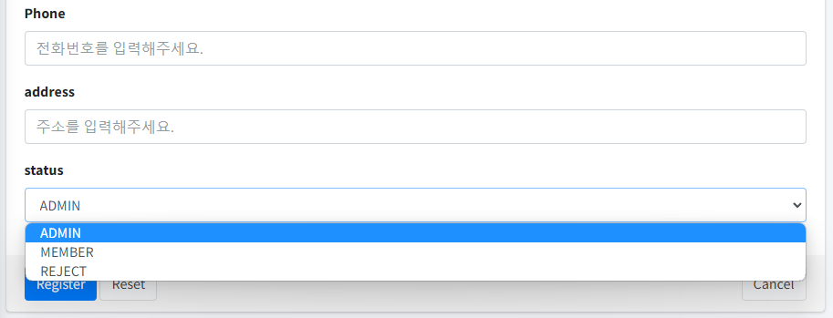

```html
members/registerForm.html

<div th:if="${session.login != null}">
  <label>status</label>
  <div class="form-group" th:if="${session.login.status == T(iducs.springboot.lmoboard.domain.Status).ADMIN}">
    <select class="form-control" name="status">
      <option th:each="state : ${Status}" th:value="${state}" th:text="${state}"/>
    </select>
  </div>
  <div class="form-group" th:unless="${session.login.status == T(iducs.springboot.lmoboard.domain.Status).ADMIN}">
    <input type="hidden" name="status" th:value="${T(iducs.springboot.lmoboard.domain.Status).MEMBER}" />
  </div>
</div>

<div class="form-group" th:unless="${session.login != null}">
    <input type="hidden" name="status" th:value="${T(iducs.springboot.lmoboard.domain.Status).MEMBER}" />
</div>
```

로그인 여부를 확인하고 로그인 유저의 상태를 enum으로 설정해 해당 enum이 관리자라면 차단 여부를 정할 수 있습니다.

```java
MemberController

@GetMapping("/registerForm")
public String getRegform(Model model) {
    model.addAttribute("member", Member.builder().build());
    model.addAttribute("Status", Status.values());
    return "members/registerForm";
}

@PostMapping("")
public String postMember(@ModelAttribute("member") Member member, Model model, HttpSession session) {
    memberService.create(member);
    model.addAttribute("member", member);
    return "index";
}
```

사용자 등록 controller 코드로 해당 유저를 추가합니다. 상태 코드를 model attribute로 추가합니다.


#
### ◈ 회원 정보, 삭제 화면
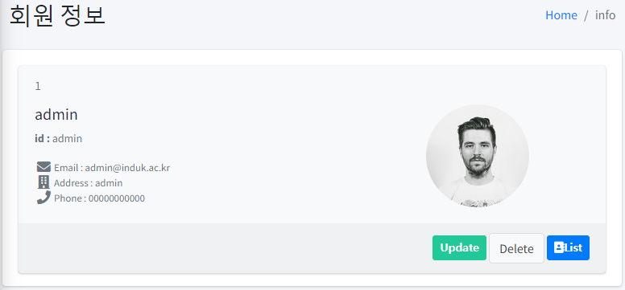
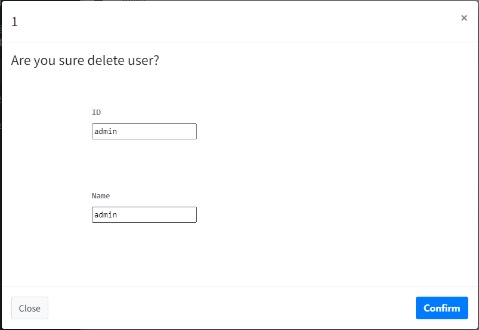

```html
members/info.html

<div class="card-header text-muted border-bottom-0">
  <span th:text="${member.seq}"/>
</div>
<div class="card-body pt-0">
  <div class="row">
    <div class="col-7">
      <h2 class="lead"><b><span th:text="${member.name}"/></b></h2>
      <p class="text-muted text-sm"><b>id : </b> <span th:text="${member.id}"/> </p>
      <ul class="ml-4 mb-0 fa-ul text-muted">
        <li class="small"><span class="fa-li"><i class="fas fa-lg fa-envelope"></i></span> Email : <span th:text="${member.email}"/></li>
        <li class="small"><span class="fa-li"><i class="fas fa-lg fa-building"></i></span> Address : <span th:text="${member.address}"/></li>
        <li class="small"><span class="fa-li"><i class="fas fa-lg fa-phone"></i></span> Phone : <span th:text="${member.phone}"/></li>
      </ul>
    </div>
    <div class="col-5 text-center">
      
    </div>
  </div>
</div>
<div class="card-footer">
  <div th:if="${session.isreject == false}">
    <div class="text-right" th:if="${session.login != null}">
      <a th:href="@{'/members/' + ${member.seq} + '/updateForm'}" class="btn btn-sm bg-teal">
        <i class="fas fa-pen-to-square">Update</i>
      </a>
      <button type="button" class="btn btn-default" data-toggle="modal" data-target="#modal-lg">
        Delete
      </button>
      <a th:href="@{'/members'}" class="btn btn-sm btn-primary">
        <i class="fas fa-address-book">List</i>
      </a>
    </div>
    <div th:unless="${session.login != null}">
      <a th:href="@{'/members'}" class="btn btn-sm btn-primary">
        <i class="fas fa-address-book">List</i>
      </a>
    </div>
  </div>
</div>

<div class="modal-header">
  <h4 class="modal-title" th:text="${member.seq}" />
  <button type="button" class="close" data-dismiss="modal" aria-label="Close">
    <span aria-hidden="true">&times;</span>
  </button>
</div>
<div class="modal-body">
  <h4> Are you sure delete user? </h4>
  <pre class="text-muted text-sm">
  <div>
    <label>ID</label>
    <input type="text" name="memberText" th:value="*{member.id}" readonly/>
  </div>
  <div>
    <label>Name</label>
    <input type="text" name="memberText" th:value="*{member.name}" readonly/>
  </div>
</pre>
</div>
<div class="modal-footer justify-content-between">
  <button type="button" class="btn btn-default" data-dismiss="modal">Close</button>
  <form action="#" th:action="@{'/members/' + ${member.seq}}" th:method="delete">
    <button class="btn btn-primary" type="submit">
      <i class="fas fa-trash-can">Confirm</i>
    </button>
  </form>
</div>
```

사용자 정보와 사용자 삭제 시 화면입니다. 사용자 정보 조회가 세션이 있어야 가능하기 때문에 삭제도 할 수 있습니다.

```java
MemberController

@GetMapping("/{idx}")
public String getMember(@PathVariable("idx") Long seq, Model model) {
    Member member = memberService.readById(seq);
    
    if (member == null) {
        return "members/lists";
    }
    
    model.addAttribute("member", member);
    return "members/info";
}

@DeleteMapping("/{idx}")
public String delMember(@ModelAttribute("idx") Long seq, HttpSession session) {
    memberService.delete(memberService.readById(seq));
    Member member = (Member) session.getAttribute("login");

    if (seq.equals(member.getSeq())){
        session.invalidate();
        return "redirect:/index";
    }
    return "redirect:/members";
}
```

사용자 정보를 나타내는 코드와 삭제 시 회원 스스로가 삭제한 경우 메인화면으로 이동하고 로그아웃 됩니다.


#
### ◈ 회원 수정 화면
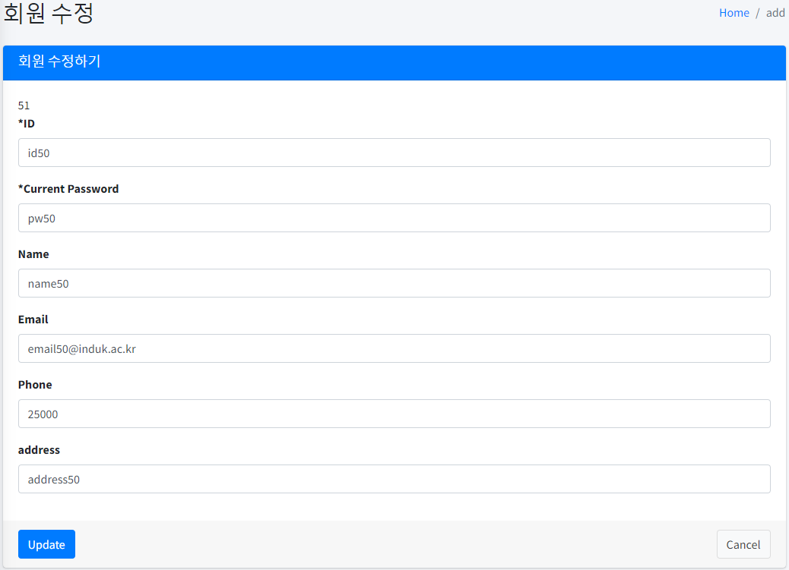
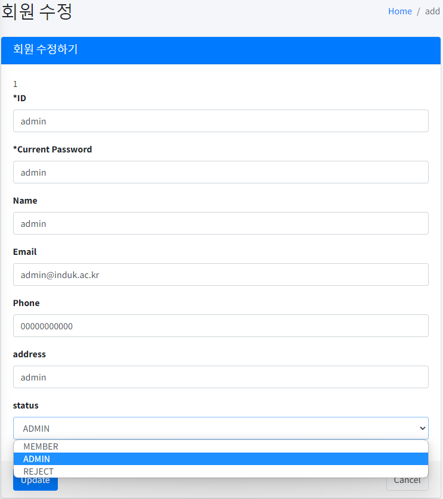

```html
members/updateForm.html
<form th:action="@{'/boards/' + ${dto.bor_id}}" th:object="${dto}" th:method="put">
  <div class="form-group">
    <label for="inputDescription">내용</label>
    <textarea id="inputDescription" class="form-control" rows="4" th:field="*{content}" th:value="*{content}"></textarea>
  </div>
  <div class="form-group">
    <label for="inputProjectLeader">작성자</label>
    <input type="text" id="inputProjectLeader" class="form-control" th:value="${session.login.seq}" th:name="writerSeq" readonly>
  </div>
  <div class="form-group" th:if="${session.login.status == T(iducs.springboot.lmoboard.domain.Status).ADMIN}">
    <label>status</label>
    <select class="form-control" name="status">
      <option th:value="${T(iducs.springboot.lmoboard.domain.BoardStatus).READABLE}" th:selected="${dto.status == T(iducs.springboot.lmoboard.domain.BoardStatus).READABLE}">상세보기</option>
      <option th:value="${T(iducs.springboot.lmoboard.domain.BoardStatus).REJECT}" th:selected="${dto.status == T(iducs.springboot.lmoboard.domain.BoardStatus).REJECT}">상세보기 차단</option>
    </select>
  </div>
  <div th:unless="${session.login.status == T(iducs.springboot.lmoboard.domain.Status).ADMIN}">
    <input type="hidden" name="status" th:value="*{status}">
  </div>
</form>
```

th:object 를 통해 해당 전달 객체의 멤버변수를 *{} 내부에 선언하면 데이터를 바로 사용해 보일 수 있습니다. 일반적인 사용 시 : ${dto.content}

등록 시와 같이 관리자일 경우 사용자의 상태에 따라 유저의 권한이나 차단 여부를 정할 수 있습니다.

```java
MembmerController

@GetMapping("/{idx}/updateForm")
public String getUpform(@PathVariable("idx") Long seq, Model model) {
    Member member = memberService.readById(seq);
    model.addAttribute("member", member);
    return "members/updateForm";
}

@PutMapping("/{idx}")
public String putMember(@ModelAttribute("member") Member member, Model model) {
    Member dto = memberService.readById(member.getSeq());

    if (!dto.getStatus().equals(member.getStatus())) {
        if (member.getStatus() == Status.REJECT) {
            memberService.rejectUserBoard(member);
        } else {
            memberService.memberUserBoard(member);
        }
    }

    memberService.update(member);

    model.addAttribute("member", member);
    return "redirect:/members";
}

MemberService

@Override
public void update(Member member) {
    MemberEntity entity = dtoToEntity(member);
    
    memberRepository.save(entity);
}

@Override
public void rejectUserBoard(Member member) {
if (member.getStatus().equals(Status.REJECT)) {
        List<Long> results = boardService.findAllWriterSeq(member.getSeq());
        
        boardService.updateRejectWriterByBoard(results);
    }
}

@Override
public void memberUserBoard(Member member) {
if (member.getStatus().equals(Status.MEMBER)) {
        List<Long> results = boardService.findAllWriterSeq(member.getSeq());
        
        boardService.updateRejectWriterByBoard(results);
    }
}

SearchBoardRepository

@PersistenceContext
private EntityManager entityManager;

@Transactional
@Override
public void updateBoardStatusREJECT(Long bor_id) {
    JPAQueryFactory queryFactory = new JPAQueryFactory(entityManager);
    
    queryFactory.update(boardEntity).where(boardEntity.bor_id.eq(bor_id))
    .set(boardEntity.status, BoardStatus.REJECT)
    .execute();
}

@Override
public void updateBoardStatusREADABLE(Long bor_id) {
    JPAQueryFactory queryFactory = new JPAQueryFactory(entityManager);
    
    queryFactory.update(boardEntity).where(boardEntity.bor_id.eq(bor_id))
    .set(boardEntity.status, BoardStatus.READABLE)
    .execute();
}
```

회원 수정에서 해당 유저의 상태 정보를 수정하면 해당 유저가 작성한 모든 게시글이 차단되거나 해제된 상태로 변경합니다.

사용자의 차단을 결정하면 BoardSearchRepository에서 JPAQueryFactory를 통해 update query 문을 작성해 해당 게시글의 읽을 수 있는 여부를 수정합니다. 


#
### ◈ 게시글 목록
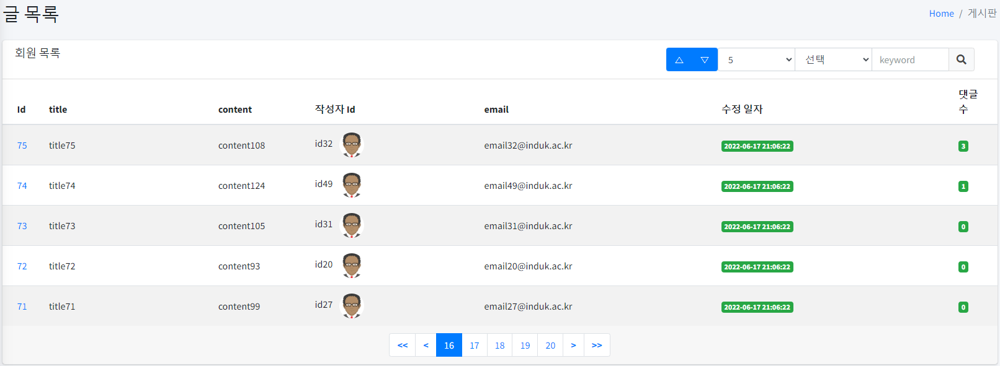
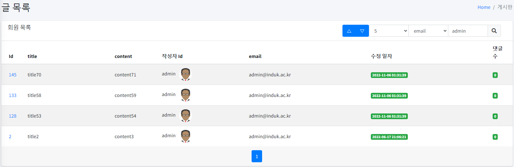

```html
<div class="btn-group">
  <button type="submit" class="btn btn-primary" name="order" value="0" th:attr="aria-pressed=${pageRequestDTO.order == 0 ? 'true' : 'false'}">
      △
  </button>
  <button type="submit" class="btn btn-primary" name="order" value="1" th:attr="aria-pressed=${pageRequestDTO.order == 1 ? 'true' : 'false'}">
      ▽
  </button>
</div>
<div class="input-group input-group-sm=" style="width: auto; height: auto">
  <select class="form-control" name="size">
      <option value="5" th:selected="${pageRequestDTO.size == 5}">5</option>
      <option value="10" th:selected="${pageRequestDTO.size == 10}">10</option>
      <option value="20" th:selected="${pageRequestDTO.size == 20}">20</option>
      <option value="50" th:selected="${pageRequestDTO.size == 50}">50</option>
  </select>

  <select class="form-control" name="type">
      <option value="" th:selected="${pageRequestDTO.type == ''}"> 선택 </option>
      <option value="t" th:selected="${pageRequestDTO.type == 't'}">title</option>
      <option value="w" th:selected="${pageRequestDTO.type == 'w'}">email</option>
      <option value="c" th:selected="${pageRequestDTO.type == 'c'}">contents</option>
  </select>
  <input type="text" name="keyword" class="form-control col-6" placeholder="keyword" th:field="*{pageRequestDTO.keyword}">

  <div class="input-group-append">
      <button type="submit" class="btn btn-default">
          <i class="fas fa-search"></i>
      </button>
  </div>
</div>

<tr th:each="board : ${list.dtoList}">
  <td th:if="${board.status == T(iducs.springboot.lmoboard.domain.BoardStatus).REJECT}">
    <span th:if="${session.login.status != T(iducs.springboot.lmoboard.domain.Status).ADMIN}">
        [[ ${board.bor_id}]]
    </span>
    <a th:href="@{'/boards/' + ${board.bor_id}}" th:unless="${session.login.status != T(iducs.springboot.lmoboard.domain.Status).ADMIN}">
      [[ ${board.bor_id}]]
    </a>
  </td>
  <td th:unless="${board.status == T(iducs.springboot.lmoboard.domain.BoardStatus).REJECT}">
    <a th:href="@{'/boards/' + ${board.bor_id}}">
      [[ ${board.bor_id}]]
    </a>
  </td>
  <td>
    [[ ${board.title}]]
  </td>
  <td>
    [[ ${board.content}]]
  </td>
  <td>
    <ul class="list-inline">
      <li class="list-inline-item">
        [[ ${board.writerId}]]
      </li>
      <li class="list-inline-item">
        
      </li>
    </ul>
  </td>
  <td>
    [[ ${board.writerEmail}]]
  </td>
  <td>
    <span class="badge badge-success" th:text="${#temporals.format(board.regDate, 'yyyy-MM-dd HH:mm:ss')}"/>
  </td>
  <td>
    <span class="badge badge-success">[[ ${board.replyCount}]]</span>
  </td>
</tr>

<nav aria-label="Contacts Page Navigation">
  <ul class="pagination justify-content-center m-0">
    <li class="page-item" th:if="${list.firstPage}">
      <a class="page-link" th:href="@{/boards(page=1, size=${pageRequestDTO.size}, type=${pageRequestDTO.type}, order=${pageRequestDTO.order}, keyword=${pageRequestDTO.keyword})}">
        <b><<</b>
      </a>
    </li>

    <li class="page-item" th:if="${list.prevPage}">
      <a class="page-link" th:href="@{/boards(page=${list.startPage - 1}, size=${pageRequestDTO.size}, order=${pageRequestDTO.order}, type=${pageRequestDTO.type}, keyword=${pageRequestDTO.keyword})}">
        <b><</b>
      </a>
    </li>

    <li th:class="'page-item' + ${list.currentPage == page? ' active':''}" th:each="page : ${list.pageList}">
      <a class="page-link" th:href="@{/boards(page=${page}, size=${pageRequestDTO.size}, order=${pageRequestDTO.order}, type=${pageRequestDTO.type}, keyword=${pageRequestDTO.keyword})}">[[${page}]]</a>
    </li>

    <li class="page-item" th:if="${list.nextPage}">
      <a class="page-link" th:href="@{/boards(page=${list.endPage + 1}, size=${pageRequestDTO.size}, order=${pageRequestDTO.order}, type=${pageRequestDTO.type}, keyword=${pageRequestDTO.keyword})}">
        <b>></b>
      </a>
    </li>

    <li class="page-item" th:if="${list.lastPage}">
      <a class="page-link" th:href="@{/boards(page=${list.totalPage}, size=${pageRequestDTO.size}, order=${pageRequestDTO.order}, type=${pageRequestDTO.type}, keyword=${pageRequestDTO.keyword})}">
        <b>>></b>
      </a>
    </li>
  </ul>
</nav>
```

검색과 페이지를 사용할 수 있는 게시글 목록입니다.

```java
BoardController

@GetMapping("")
public String getBoards(PageRequestDTO pageRequestDTO, HttpSession session, Model model) {
    if (session.getAttribute("login") != null) {
        model.addAttribute("list", boardPageService.getList(pageRequestDTO));
        return "boards/lists";
    }
    else {
        return "index";
    }
}

BoardService

@Override
public PageResultDTO<Board, Object[]> getList(PageRequestDTO pageRequestDTO) {
    Function<Object[], Board> fn = (entities -> entityToDto((BoardEntity) entities[0], (MemberEntity) entities[1], (Long) entities[2]));
    log.info("get test entities : {}", fn);
    Sort sort = pageRequestDTO.getOrder() == 0 ? Sort.by("bor_id").descending() : Sort.by("bor_id").ascending();
    Page<Object[]> result = searchBoardRepository.searchPage(pageRequestDTO.getType(), pageRequestDTO.getKeyword(), pageRequestDTO.getPageable(sort));
    
    return new PageResultDTO<>(result, fn);
}

PageRequestDTO

@Builder
@AllArgsConstructor
@Data
public class PageRequestDTO {
    private int page;
    private int size;
    private int order;
    private String type; // e - email, p - phone, a - address 페이지 조회 기준
    private String keyword; // 검색어
    
    public PageRequestDTO() {
      this.page = 1;
      this.size = 5;
    }
    
    public PageRequest getPageable(Sort sort) {
      return PageRequest.of(page - 1, size, sort);
    }
}

PageResultDTO

@Data
public class PageResultDTO<DTO, EN> {
    private List<DTO> dtoList;
    private int totalPage;
    
    private int currentPage;
    private int sizeOfPage;
    private int numberOfPage;
    
    private int startPage, endPage;
    private boolean firstPage, lastPage;
    private boolean prevPage, nextPage;
    private List<Integer> pageList;
    
    public PageResultDTO(Page<EN> result, Function<EN, DTO> fn) {
        dtoList = result.stream().map(fn).collect(Collectors.toList());
        totalPage = result.getTotalPages();
        makePageList(result.getPageable());
    }
    
    public void makePageList(Pageable pageable) {
        this.setPageSizeAndCurrent(pageable);
        double pageDouble = (double) sizeOfPage;
        this.setNumberOfPage(5);
        int tempEnd = (int)(Math.ceil(currentPage/pageDouble)) * sizeOfPage;
      
        startPage = tempEnd - (sizeOfPage - 1);
        endPage = (totalPage > tempEnd) ? tempEnd: totalPage;
        prevPage = startPage > 1;
        nextPage = totalPage > tempEnd;
      
        firstPage = prevPage;
        lastPage = nextPage;
      
        pageList = IntStream.rangeClosed(startPage, endPage).boxed().collect(Collectors.toList());
    }
    
    public void setPageSizeAndCurrent(Pageable pageable) {
        this.currentPage = pageable.getPageNumber() + 1;
        this.setNumberOfPage(5);
        this.sizeOfPage = this.numberOfPage;
    }
    
    public void setNumberOfPage(int numberOfPage) {
        this.numberOfPage = numberOfPage;
    }
}

SearchBoardRepository

@Override
public Page<Object[]> searchPage(String type, String keyword, Pageable pageable) {
    JPQLQuery<Tuple> tuple = jpqlBuilder();
  
    BooleanBuilder booleanBuilder = new BooleanBuilder();
    BooleanExpression expression = boardEntity.bor_id.gt(0L);
  
    booleanBuilder.and(expression);
    log.info("1 result of page : {}", tuple.fetch());
  
    if (type != null) {
        String[] typeArr = type.split("");
        BooleanBuilder conditionBuilder = new BooleanBuilder();
    
        for(String t : typeArr) {
            switch (t) {
                case "t":
                  conditionBuilder.or(boardEntity.title.contains(keyword));
                  break;
                case "w":
                  conditionBuilder.or(memberEntity.email.contains(keyword));
                  break;
                case "c":
                  conditionBuilder.or(boardEntity.content.contains(keyword));
            }
        }
        booleanBuilder.and(conditionBuilder);
    }
    tuple.where(booleanBuilder);
    log.info("2 result of page : {}", tuple.fetch());
  
    Sort sort = pageable.getSort();
    sort.stream().forEach(order -> {
        Order direction = order.isAscending() ? Order.ASC: Order.DESC;
        String prop = order.getProperty();
        PathBuilder orderByExpression = new PathBuilder(BoardEntity.class, "boardEntity");
        tuple.orderBy(new OrderSpecifier(direction, orderByExpression.get(prop)));
    });
    log.info("3 result of page : {}", tuple.fetch());
  
    tuple.groupBy(boardEntity);
  
    tuple.offset((pageable.getOffset()));
    tuple.limit(pageable.getPageSize());
  
    List<Tuple> result = tuple.fetch();
  
    log.info("last result of page : {}", tuple.fetch());
    log.info("result of page : {}", result);
    long count = tuple.fetchCount();
  
    return new PageImpl<Object[]>(result.stream().map(t -> t.toArray()).collect(Collectors.toList()), pageable, count);
}
```

게시글에 대한 목록에 검색과 페이지 처리를 위한 코드입니다.

페이지 처리 과정
페이지 처리를 위해 page request를 데이터로 받아 pageRequest.of 를 사용해 size, page, order를 정한 PageRequest 객체를 반환합니다. 
데이터를 담는 객체를 통해 검색용 키워드, 페이지, 사이즈, 정렬순을 쿼리문을 SearchBoardRepository에서 생성해 페이지와 데이터 목록을 Page<Object[]>로 반환합니다.

반환된 객체는 PageResultDTO에서 stream으로 entity를 dto로 변환한 결과 리스트 (object[] 내에는 각자 entity에 해당되는 값이 있음)를 가진 객체를 반환해 controller에서 model attribute로 전달해
front에서 page와 size, order, 검색 keyword에 대해 사용할 수 있습니다.


#
### ◈ 게시글 상세 정보, 삭제
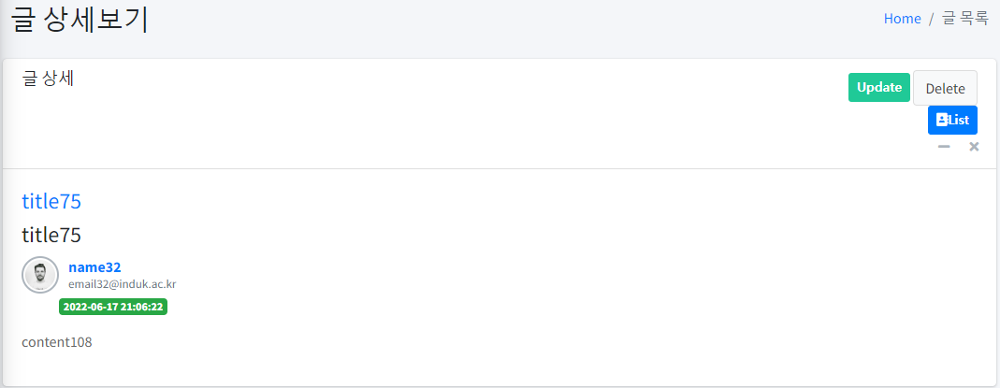
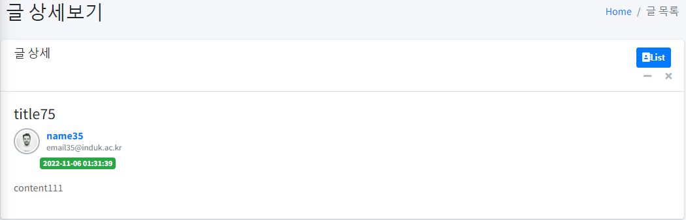
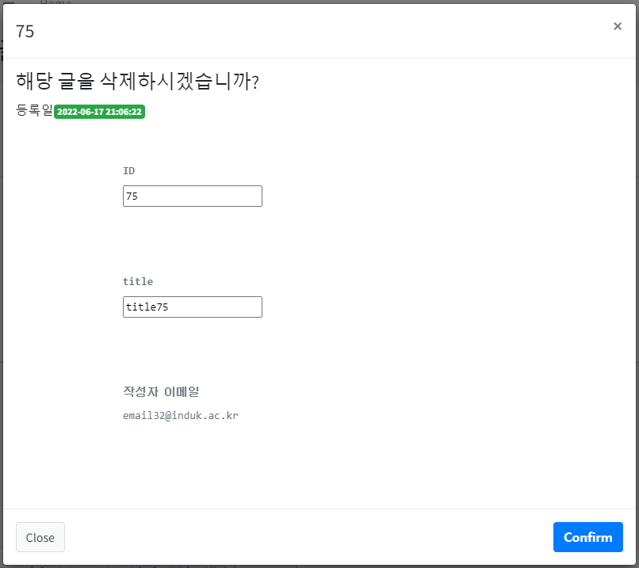

```html
boards/info.html

<div class="text-right">
  <div th:if="${session.login != null}">
    <div th:if="${(dto.writerSeq == session.login.seq) or (session.login.status == T(iducs.springboot.lmoboard.domain.Status).ADMIN)}">
      <a th:href="@{'/boards/' + ${dto.bor_id} + '/updateForm'}" class="btn btn-sm bg-teal">
        <i class="fas fa-pen-to-square">Update</i>
      </a>
      <button type="button" class="btn btn-default" data-toggle="modal" data-target="#modal-lg">
        Delete
      </button>
    </div>
    <a th:href="@{'/boards'}" class="btn btn-sm btn-primary">
      <i class="fas fa-address-book">List</i>
    </a>
  </div>
</div>

<div class="modal-header">
  <h4 class="modal-title" th:text="${dto.bor_id}" />
  <button type="button" class="close" data-dismiss="modal" aria-label="Close">
    <span aria-hidden="true">&times;</span>
  </button>
</div>
<div class="modal-body">
  <h4>해당 글을 삭제하시겠습니까?</h4>
  <span>등록일</span><span class="badge badge-success" th:text="${#temporals.format(dto.regDate, 'yyyy-MM-dd HH:mm:ss')}"/>
  <pre class="text-muted text-sm">
    <div>
      <label>ID</label>
      <input type="text" th:value="*{dto.bor_id}" readonly/>
    </div>
    <div>
      <label>title</label>
      <input type="text" th:value="*{dto.title}" readonly/>
    </div>
    <div>
      <label>작성자 이메일</label>
      [[${dto.writerEmail}]]
    </div>
  </pre>
</div>
<div class="modal-footer justify-content-between">
  <button type="button" class="btn btn-default" data-dismiss="modal">Close</button>
  <form action="#" th:action="@{'/boards/' + ${dto.bor_id}}" th:method="delete">
    <button class="btn btn-primary" type="submit">
      <i class="fas fa-trash-can">Confirm</i>
    </button>
  </form>
</div>
```

게시글 정보와 게시글 삭제 화면

만일 사용자가 작성한 게시글이 아니라면 수정, 삭제가 불가능합니다. 관리자는 모든 게시글을 수정, 삭제할 수 있습니다.

```java
BoardController

@GetMapping("/{bor_id}")
public String getInfo(@PathVariable("bor_id") Long bor_id, HttpSession session, Model model) {
    if (session.getAttribute("login") != null) {
        Board board = boardService.getById(bor_id);
        if (board == null) {
            return "boards/lists";
        }
        model.addAttribute("dto", board);
        return "boards/info";
    }
    else {
        return "index";
    }
}

@DeleteMapping("/{idx}")
public String delBoard(@ModelAttribute("idx") Long bor_id, HttpSession session) {
    if (session.getAttribute("login") != null) {
        boardService.deleteWithRepliesById(bor_id);
        return "redirect:/boards";
    }
    else {
        return "index";
    }
}

BoardService

@Override
public Board getById(Long bor_id) {
    Object result = boardRepository.getBoardByBor_id(bor_id);
    Object[] resultEntity = (Object[]) result;
    
    return entityToDto((BoardEntity) resultEntity[0], (MemberEntity) resultEntity[1], (Long) resultEntity[2]);
}

@Transactional
@Override
public void deleteWithRepliesById(Long bor_id) {
    replyRepository.deleteByBor_id(bor_id);
    boardRepository.deleteById(bor_id);
}

BoardRepository

@Query("select b, w, count(r) from BoardEntity b left join b.writer w left join ReplyEntity r on r.boardEntity = b where b.bor_id = :bor_id")
Object getBoardByBor_id(@Param("bor_id") Long bor_id);
```

게시글 정보와 삭제입니다.

Spring의 DataJPA를 활용해 삭제 함수를 사용했습니다. 조회는 QuerydslPredicateExecutor를 통해 Query문을 직접 작성해 left join에 대해 처리해 기본 Data-JPA 에서 조회가 되지 않는 문제를
해결했습니다.


#
### ◈ 게시글 등록 화면
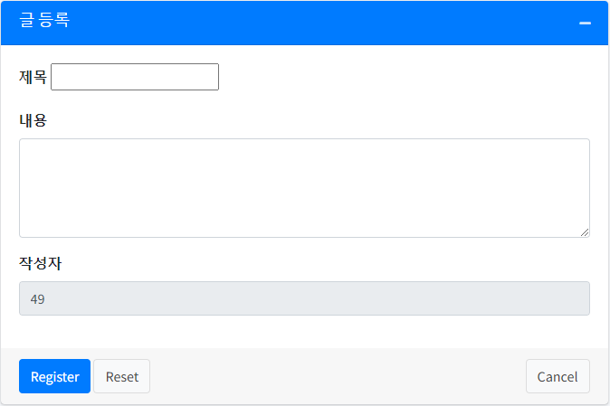
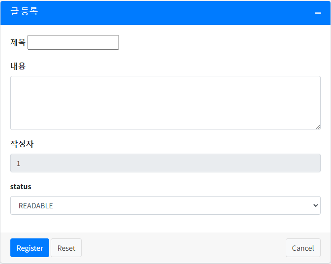

```html
<div class="form-group">
  <label for="inputProjectLeader">작성자</label>
  <input type="text" id="inputProjectLeader" class="form-control" th:value="${session.login.seq}" th:name="writerSeq" readonly>
</div>
<div class="form-group" th:if="${session.login.status == T(iducs.springboot.lmoboard.domain.Status).ADMIN}">
  <label>status</label>
  <select class="form-control" name="status">
    <option th:each="state : ${Status}" th:value="${state}" th:text="${state}"/>
  </select>
</div>
<div class="form-group" th:unless="${session.login.status == T(iducs.springboot.lmoboard.domain.Status).ADMIN}">
  <input type="hidden" name="status" th:value="${T(iducs.springboot.lmoboard.domain.BoardStatus).READABLE}" />
</div>
```

```java
@GetMapping("/registerForm")
public String getRegForm(HttpSession session, Model model) {
    if (session.getAttribute("login") != null) {
        model.addAttribute("dto", Board.builder().build());
        model.addAttribute("Status", BoardStatus.values());
        return "boards/registerForm";
    }
    else {
        return "index";
    }
}

@PostMapping
public String postRegForm(@ModelAttribute("board") Board board) {
    boardService.register(board);
    return "redirect:/boards";
}
```

service에서 JPA 상속 repository를 활용해 게시글 저장


#
### ◈ 게시글 수정 화면
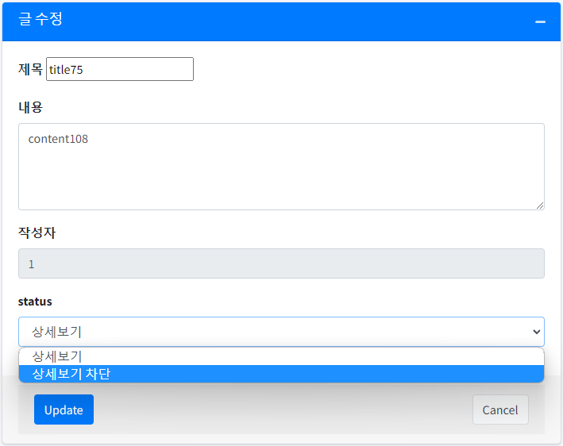
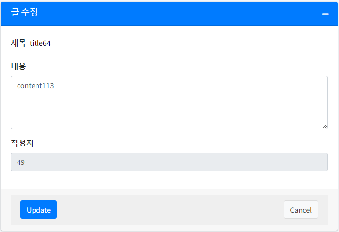

```html
<div class="form-group">
  <label for="inputProjectLeader">작성자</label>
  <input type="text" id="inputProjectLeader" class="form-control" th:value="${session.login.seq}" th:name="writerSeq" readonly>
</div>
<div class="form-group" th:if="${session.login.status == T(iducs.springboot.lmoboard.domain.Status).ADMIN}">
  <label>status</label>
  <select class="form-control" name="status">
    <option th:value="${T(iducs.springboot.lmoboard.domain.BoardStatus).READABLE}" th:selected="${dto.status == T(iducs.springboot.lmoboard.domain.BoardStatus).READABLE}">상세보기</option>
    <option th:value="${T(iducs.springboot.lmoboard.domain.BoardStatus).REJECT}" th:selected="${dto.status == T(iducs.springboot.lmoboard.domain.BoardStatus).REJECT}">상세보기 차단</option>
  </select>
</div>
<div th:unless="${session.login.status == T(iducs.springboot.lmoboard.domain.Status).ADMIN}">
  <input type="hidden" name="status" th:value="*{status}">
</div>
</div>
<!-- /.card-body -->
<div class="card-footer">
  <div class="card-footer">
    <button type="submit" class="btn btn-primary">Update</button>
    <a th:href="@{'/boards'}" class="btn btn-default float-right">Cancel</a>
  </div>
</div>
```

게시글 수정 시 회원이 관리자인지 아닌지 확인되면 게시글의 차단 여부를 변경할 수 있습니다. 게시글 수정으로 들어오면 자동으로 회원의 계정과 같은 사용자로 변경됩니다.

```java
BoardController

@GetMapping("/{bor_id}/updateForm")
public String getUpform(@PathVariable("bor_id") Long bor_id, HttpSession session, Model model) {
    if (session.getAttribute("login") != null) {
        Board board = boardService.getById(bor_id);
        model.addAttribute("dto", board);
        return "boards/updateForm";
    }
    else {
        return "index";
    }
}

@PutMapping("/{bor_id}")
public String putBoard(@ModelAttribute("board") Board board, Model model) {
    boardService.updateBoard(board);
    model.addAttribute("dto", board);
    return "redirect:/boards";
}
```

일반 회원은 게시글의 상태를 변경할 수 없고 관리자는 특정 게시글에 차단, 읽기 가능 여부를 설정할 수 있습니다. 해당 설정 시 관리자의 글로 변경됩니다.


#
### 보완점
- 로그인
  - 보완해야 할 점 : 세션으로 구축한 부분이 실수 재로그인 시 실패 세션이 남아있는 경우가 있기도 하고, 아예 로그아웃에도 세션이 유지되는 경우가 있어서 보완이 필요합니다.
  - 보완해야 할 점 : 단 로그인 아이디와 패스워드 내 불가능한 입력, 중복 확인 처리가 없기 때문에 해당 처리가 필요합니다. 에러 처리와 유효성 처리가 필요합니다.
  세션 처리와 로그인 처리를 진행하는데, 로그인이 되고 되지 않고를 검사하는 오류를 함수로 빼낼 수 있습니다. 거절된 사용자에 대해 세션이 아닌 model attribute를 사용하도록 바꿔야 할 것 같습니다.
  해당 로그인 수행은 세션을 통해 처리되므로 패스워드가 노출될 가능성이 있습니다. Spring Security를 통해 패스워드를 토큰처리해서 관리하는 쪽이 더 안정적일 것 같습니다.
  에러와 유효성 처리 필요
  
- 목록
  - 보완해야 할 점 : 해당 검색 처리를 service에서 QueryDSL entitiy로 생성한 QMemberEntity로 처리함. repository에서 처리해야 하는 기능이라고 생각함. boardRepository는 실제로 그렇게 되어있음.
  
- 등록
  - 보완해야 할 점 : 사용자 추가 시 입력되는 값에 대해 유효성 검사와 에러 처리를 해야합니다.
  
- 수정
  - 보완해야 할 점 : 회원의 상태에 따른 글 수정을 (boardService) memberService에서 다루도록 되어있어, 해당 기능에 대해 변경해야 됩니다.