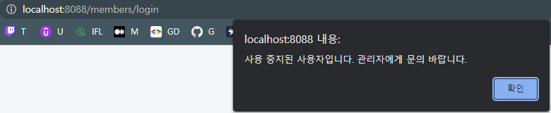

## 게시판 관리자 사이트

- 프로젝트 : 학교 프로젝트
- 언어 : Java
- 프레임워크 : Spring
- 라이브러리 : Spring Boot, JPA, QueryDSL, Thymeleaf
- DB : MariaDB
- 기간 : 2022. 04. ~ 06.

# 로직 상세

로그인 순서
- MemberController -> MemberService 유저 id, pw 확인 -> 미 가입 유저 시 반환값에 따라 처리
  - 미가입 시 id, pw가 틀렸다고 나타내도록 세션 생성
  - 가입된 사용자일 시
    - 거부된 사용자일 경우 메시지를 보냄
    - 이상이 없다면 메인화면으로 이동

전체적인 기능
- 회원의 권한에 따라 접근 가능한 서비스가 다름
  - 비로그인
    - 회원 정보를 볼 수 없고 회원 가입만 가능
    - 게시글 조회 불가능
  - 일반 회원
    - 회원 정보를 볼 수 있음
    - 게시글 목록, 조회, 작성, 수정 가능
    - 자신의 게시글만 수정, 삭제 가능
  - 관리자 회원
    - 회원 정보를 볼 수 있음
    - 회원 목록을 볼 수 있음
    - 회원의 차단, 관리자 설정을 할 수 있음
    - 게시글 목록, 조회, 작성, 수정 가능
    - 모두의 게시글을 수정, 삭제 가능
    - 게시글을 차단할 수 있음

# 구현 상세

게시판 프로젝트의 메인화면

```java
main screen
```




```java
login before
```


```html
login after
```

